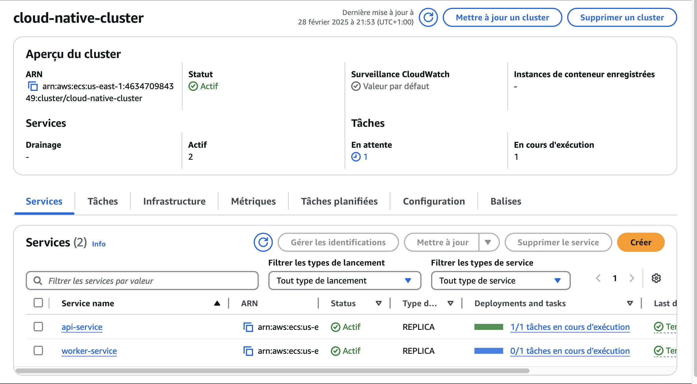
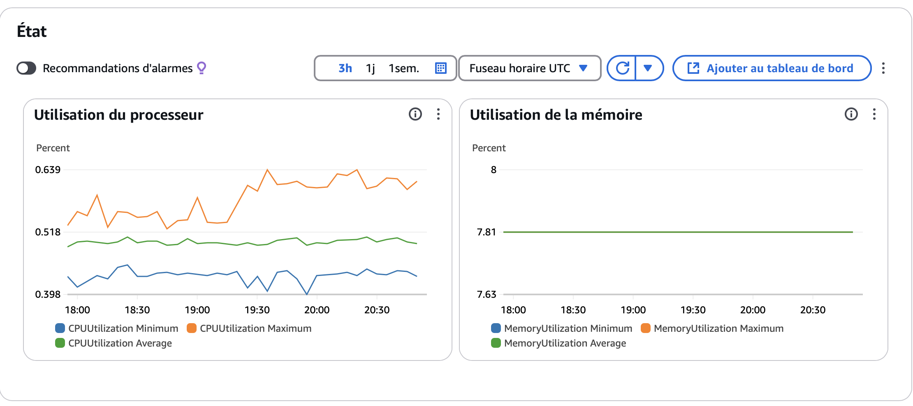
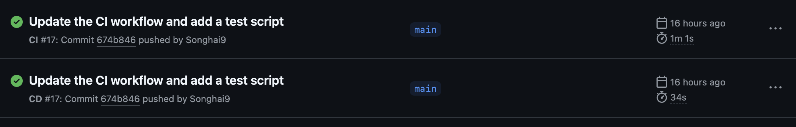
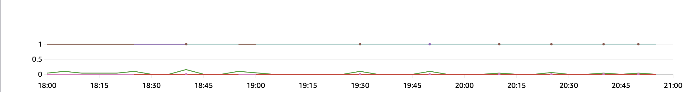
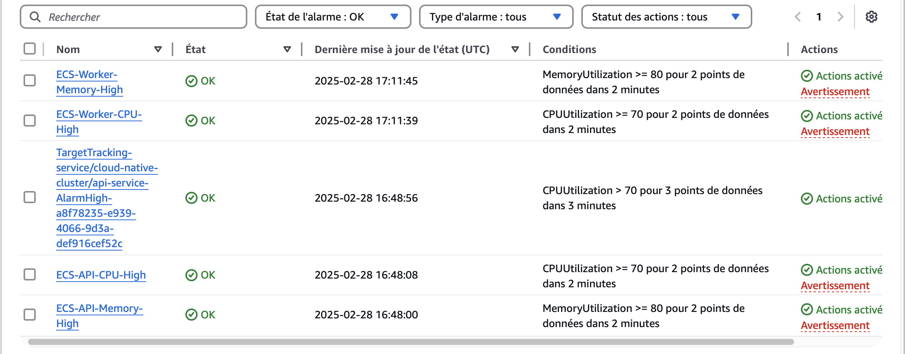
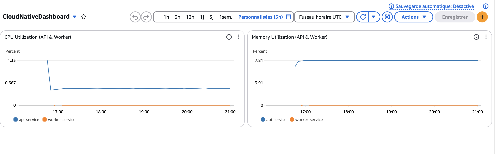

# Cloud-Native Deployment on AWS with GitHub Actions & Terraform

## 📌 **Overview**
This project implements a **cloud-native architecture** on **AWS** using **ECS (Fargate), ALB, Terraform, and GitHub Actions** for CI/CD automation. The infrastructure is fully managed as **Infrastructure as Code (IaC)**, and the deployment follows DevOps best practices.
The idea was for me to learn how to interact with the tools and have a personal project to present.

## 🏗 **Architecture Overview**


### **Key Components**
- **VPC & Subnets**: Isolated private and public subnets.
- **ALB (Application Load Balancer)**: Public-facing load balancer routing traffic to ECS.
- **ECS (Fargate)**: Serverless containers running API and Worker services.
- **ECR (Elastic Container Registry)**: Stores Docker images.
- **CloudWatch**: Logs, metrics, and alarms for monitoring.
- **GitHub Actions**: CI/CD pipelines for automated deployment.



Here's an example of the state of api-service at a given time

---

## 🚀 **Getting Started**

### **1️⃣ Prerequisites**
- AWS CLI installed (`aws configure` with your credentials)
- Terraform installed
- Docker installed
- GitHub repository cloned locally:
  ```bash
  git clone https://github.com/your-username/cloud-native-ci-cd-aws.git
  cd cloud-native-ci-cd-aws
  ```

### **2️⃣ Infrastructure Deployment (Terraform)**
```bash
cd Infrastructure
terraform init
terraform apply -auto-approve
```

### **3️⃣ Build & Push Docker Images**
```bash
aws ecr get-login-password --region us-east-1 | docker login --username AWS --password-stdin <AWS_ACCOUNT_ID>.dkr.ecr.us-east-1.amazonaws.com

# API Service
cd Application/service-api
docker build -t service-api .
docker tag service-api:latest <AWS_ACCOUNT_ID>.dkr.ecr.us-east-1.amazonaws.com/service-api:latest
docker push <AWS_ACCOUNT_ID>.dkr.ecr.us-east-1.amazonaws.com/service-api:latest
```

### **4️⃣ Deploy to ECS**
```bash
terraform apply -auto-approve
```

### **5️⃣ Test Deployment**
```bash
curl -I http://<load-balancer-url>/
```
---

## 🔄 **CI/CD Pipelines (GitHub Actions)**
- **CI Pipeline (`.github/workflows/ci.yml`)**
  - Runs tests (pytest, security scanning)
  - Builds Docker image
- **CD Pipeline (`.github/workflows/cd.yml`)**
  - Pushes image to ECR
  - Updates ECS Task Definition

To trigger a deployment:
```bash
git push origin main
```



---

## 📊 **Monitoring & Observability**

### **1️⃣ CloudWatch Logs**
View logs:
```bash
aws logs tail /ecs/api --follow
```

### **2️⃣ Metrics & Alarms**
- Monitor ECS CPU/memory usage
- Auto-scaling triggers if CPU > 70%

### **3️⃣ Load Testing (k6)**
```bash
k6 run --vus 50 --duration 2m script_test.js
```

Here's a **graph** showing the CPU/memory usage. 


Here's also the **alarms** I get when conditions are met in a certain situation, such as when the usage of the** CPU usgae exceeds a given percentage**.


**AWS Cloudwatch Dashboard**


---

## 🔒 **Best Practices**

### **1️⃣ Security**
✅ Use IAM roles with least privilege.  
✅ Store secrets in AWS Secrets Manager.  
✅ Restrict security groups (allow only necessary traffic).  

### **2️⃣ Performance & Cost Optimization**
✅ Enable ECS auto-scaling.  
✅ Use CloudWatch alarms for cost monitoring.  
✅ Optimize Docker images (multi-stage builds).  

### **3️⃣ Infrastructure as Code**
✅ Keep Terraform modular (VPC, ECS, ALB separate).  
✅ Use `terraform plan` before applying changes.  
✅ Version-control Terraform state (S3 backend recommended).  

---

## 📌 **Project Structure**
```
.
├── Architecture/
│   ├── architecture-diagram.md
│   ├── architecture-description.md
│
├── Infrastructure/
│   ├── main.tf
│   ├── vpc.tf
│   ├── ecs.tf
│   ├── alb.tf
│   ├── security.tf
│   ├── variables.tf
│   ├── outputs.tf
│   |── iam.tf
|   |── autoscaling.tf
|   |── service.tf
|   |── task-definitions.tf
|   |── provider.tf
|
├── Application/
│   ├── service-api/
│   │   ├── app.py
│   │   ├── Dockerfile
│   │   ├── requirements.txt
|   |
|   |── service-worker/
|       |── worker.py
|       |── Dockerfile
│
├── .github/workflows/
│   ├── ci.yml
│   ├── cd.yml
│
└── README.md
```

---

## 📢 **Contributions & Future Improvements**
Feel free to open an issue or PR to improve the infrastructure or add new features!

